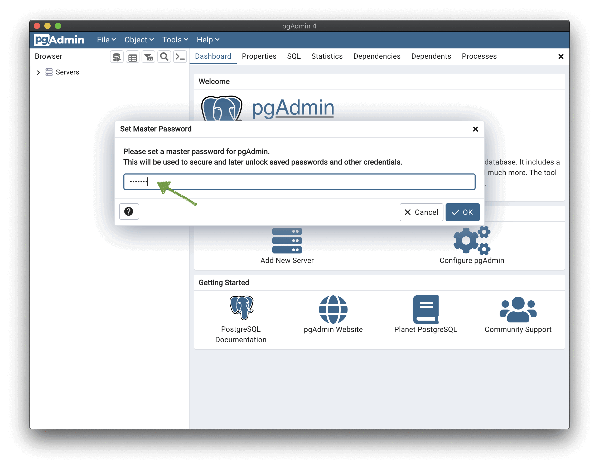
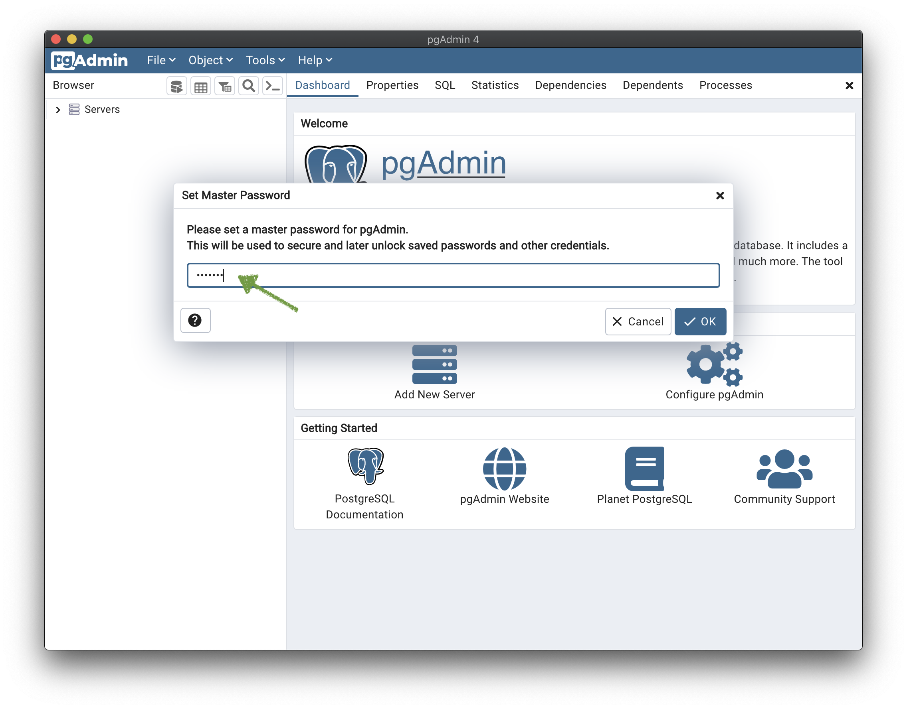
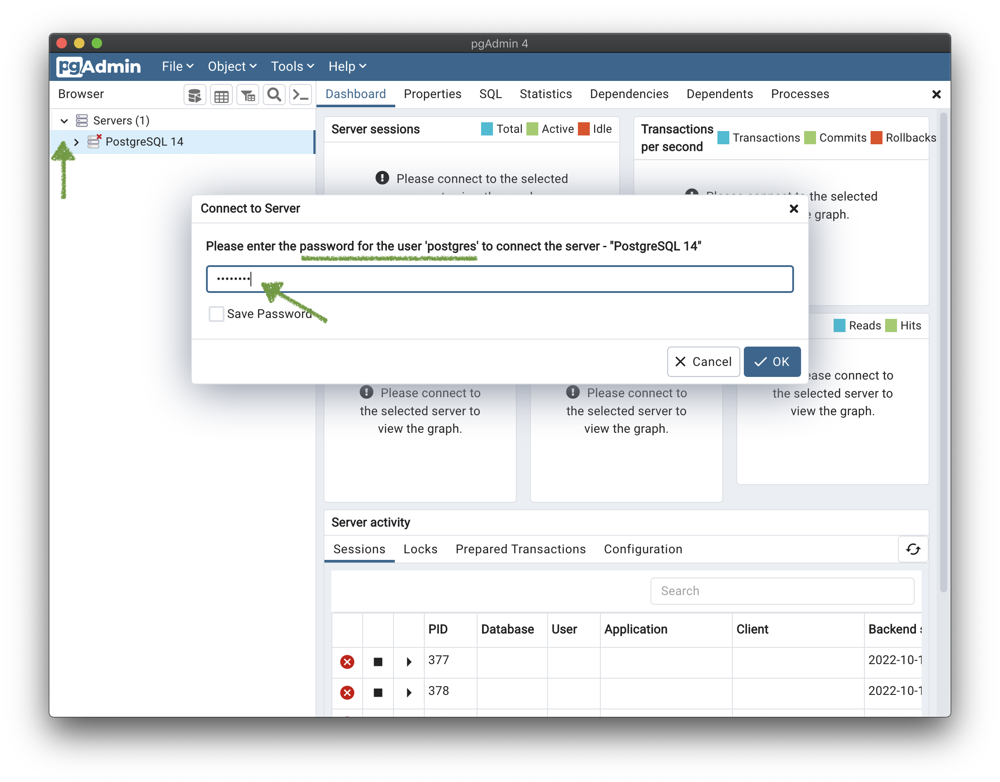
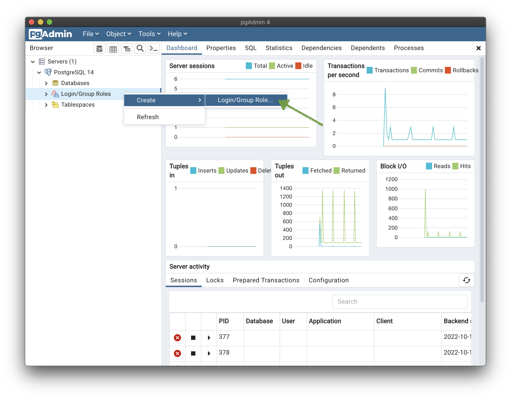
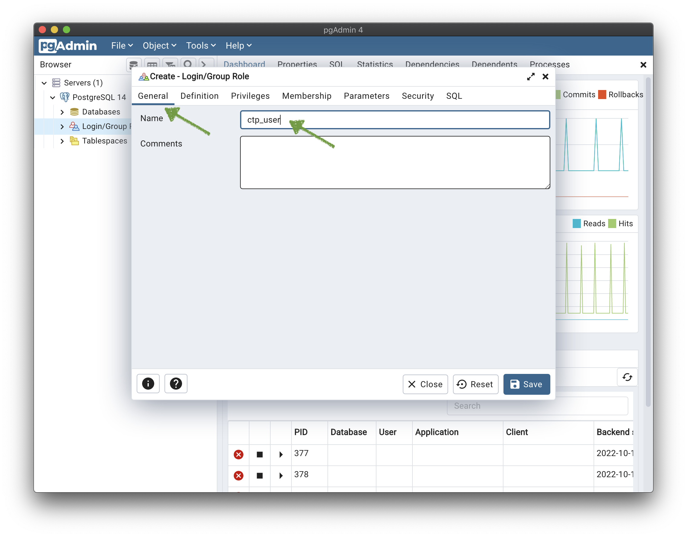
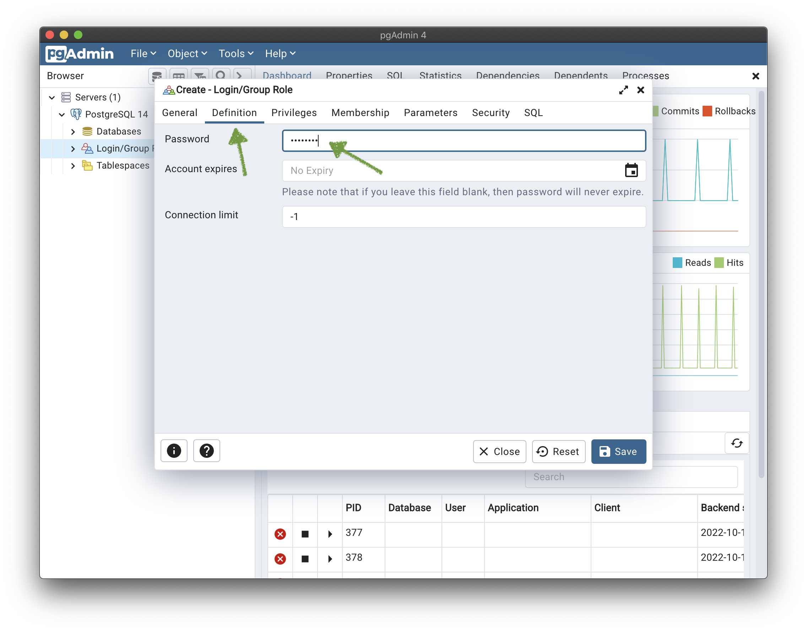
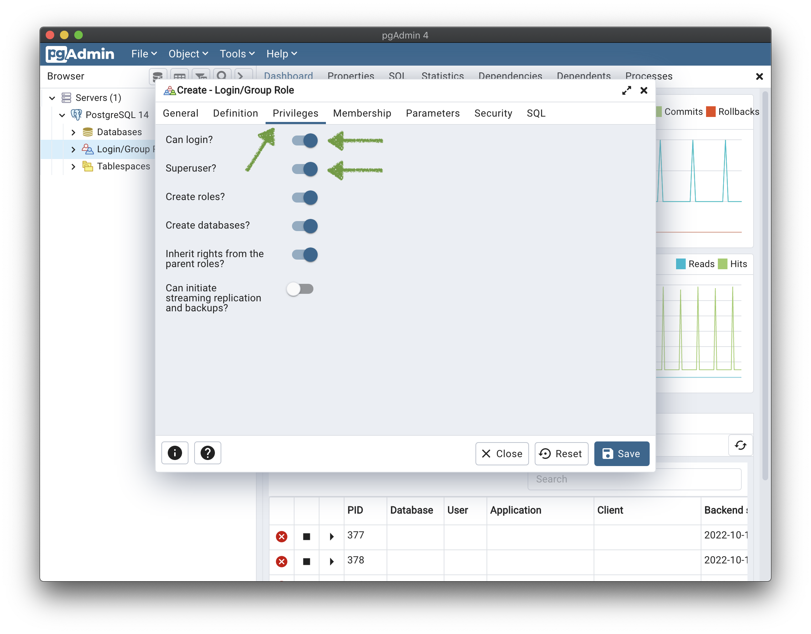
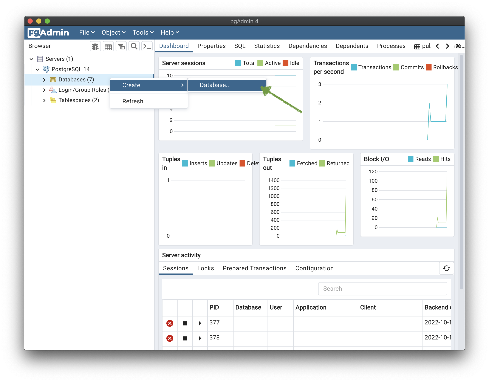
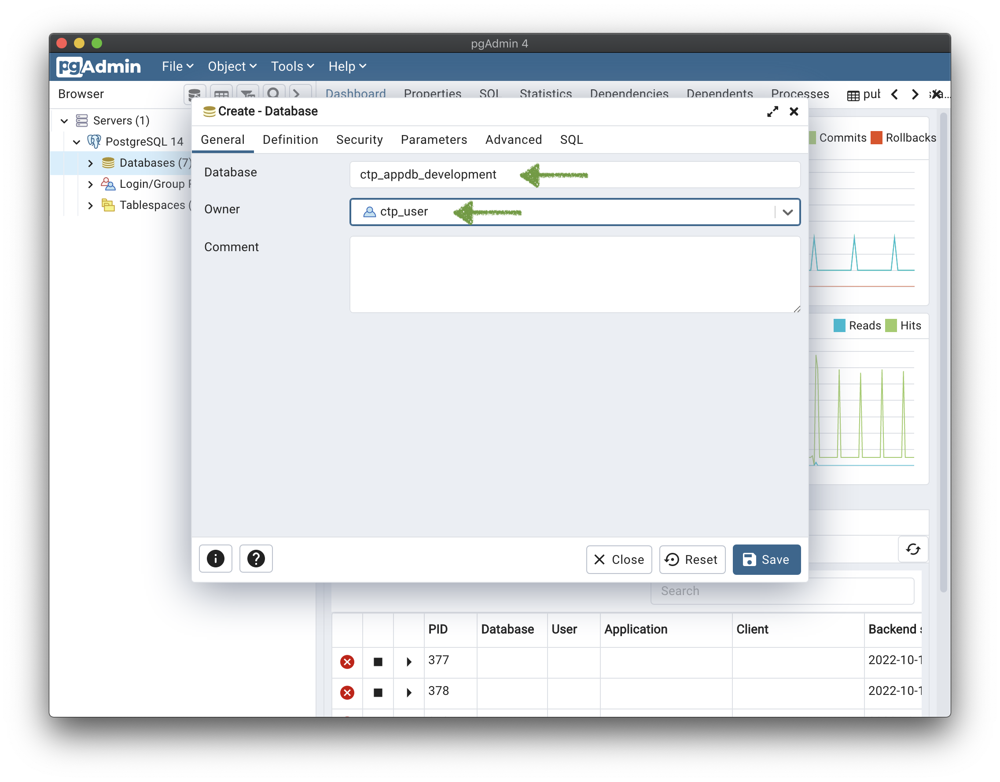

# How to create users and databases with pgAdmin

 
*TLDR: All steps to create a user and database in pgAdmin. Detailed instructions below.*

## Creating Users and Databases for PostgreSQL projects

The PostgreSQL server runs in the background and can serve multiple databases for your different projects. Anytime you start a new project, the first thing you'll want to do is setup a database. You can use the pgAdmin application to create users and databases.

> NOTE: pgAdmin is usually installed with the graphical installers of PostgreSQL. If you installed using `brew` or `apt`, you would have to install pgAdmin separately.

### Step 1. Setting a pgAdmin master password

The very first time you launch pgAdmin you will have to set a **master password for pgAdmin**. Create a password and save it (you'll need it to access pgAdmin in the future).

> Note: PostgreSQL and pgAdmin are separate pieces of software. The pgAdmin master password serves a different purpose from your PostgreSQL passwords.

### Step 2. Create a user

- Open the **> Servers** in the browser on the left hand side of pgAdmin.
- Click on your **PostgreSQL** server to connect
- You may then be prompted for your **postgres** user password
    - If you installed PostgreSQL using a graphical installer (most Windows users), you were prompted to create this password during installation. Use that password here.

### Step 3. Create a user

- Right-click on the **Login/Group Roles** entry in the server browser
- Select **Create > Login/Group Role...**

### Step 4. Add user general details

- In the **General** tab...
- Add the database user's name

### Step 5. Add user definition details

- In the **Definition** tab...
- Add the database user's password

> NOTE: be careful not to edit the expiration or you won't be able to login with this user.

### Step 6. Add user privileges details

- In the **Privileges** tab...
- Enable the permissions **Can login?** and **Superuser?**
- Click the **Save** button

### Step 7. Create a database

- Right-click on the **Databases** entry in the server browser
- Select **Create > Database...**

### Step 8. Add database details

- In the **General** tab...
- Add your database **Name**
- Select the database **Owner**
    - set it to the user created in [step 4 above](#step-4-add-user-general-details)
- Click the **Save** button

### Done

You can now use this PostgreSQL user and database in your project.